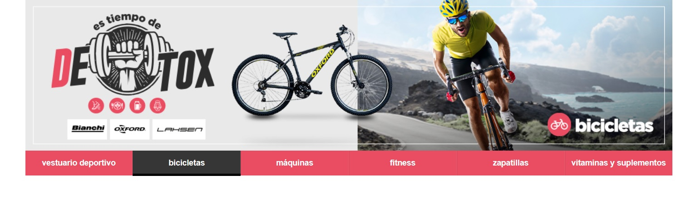
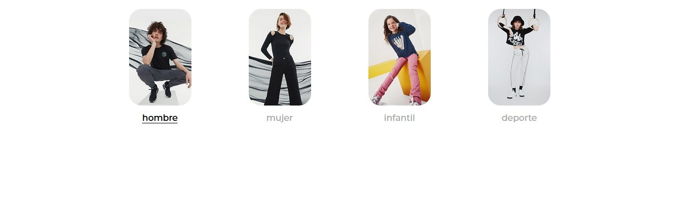

# Manual de uso para Front en Agencia Cabeza

###### Documentación basada en las buenas prácticas de "Code Clean" (Robert C. Martin).

###### > Ærlighed i små ting er ikke nogen lille ting --> "La honestidad por las cosas pequeñas no es algo menor"

## Prólogo

Este manual de uso busca **_desarrollar normativas de apoyo en la toma de decisiones_** el desarrollo de infraestructura de software,estableciendo metodologías y parámetros para estandarizar las creaciones y optimizar el mantenimiento de estas.
La integración de estos patrones por parte de cada desarrollador del equipo es fundamental para lograr un desarrollo sostenible.

---

El manual requiere estar en constante actualización y debe ser reformulado en la medida en que se presenten experiencias que determinen agregar/quitar/actualizar según avanza la tecnología en el diseño de software.
Este manual contiene características orgánicas e híbridas, para que su relación con la praxis sea lo más fiel a la realidad de productividad.

## Preceptos

# ORDEN/ RENDIMIENTO/ OPTIMIZACIÓN/ REFACTORIZACIÓN

---

### Desarrollo de Landing.

`Las landing son estructuras visuales simples en su planteamiento` pero generan complejidad al desarrollarlas. La marca y el cliente buscan hacer un llamado de atención mediante una pieza original pensada en la conducta de un usuario en particular, recurriendo a una estructura compleja con interacciones diversas. Estableciendo así, verdaderas piezas gráficas de uso único, es decir, no es posible crear una maqueta base o prototipo para el desarrollo de las landing.

Pero si se pueden establecer ciertas normas a seguir para optimizar su desarrollo y facilitar una potencial mantención.

#### Reglas madres:

1. Normas de escritura ARCHIVOS/ID/CLASS/VARIABLES:

A) **Nomenclatura para nombrar archivos**

```
<!-- número del día, seguido de un guión medio, nombre declarativo de la actividad -->

03-soloxhoy
10-octubre

```

B) **Norma UPPER_CASE para nombrar id y constante en variable JS**

```
const UNA_CONSTANTE (caso de JSE6)

id="LANDING-EXAMPLE" (caso de html)

#LANDING-EXAMPLE (caso de style.css)

```

C) **Norma lowerCamelCase para nombrar clases**

para nombrar clases `(class)`

```
class="wrapTextoMarketplace"

```

2. Etiquetas **MADRES**:

ejemplo: etiquetas ** envolventes (wrap) ** otorgadas por Ripley para el reconocimiento en la plataforma.

_HEAD_

```
<mini-site-styles>

    <meta charset="UTF-8" />
    <meta http-equiv="X-UA-Compatible" content="IE=edge" />
    <meta name="viewport" content="width=device-width, initial-scale=1.0" />
    <title>Landing Marketplace</title>

</mini-site-styles>
```

_BODY_

```
<mini-site>

<!-- div envolvente para lograr la especificidad de las etiquetas en style.css -->

  <div id="landing-example">
  <!-- CONTENIDO -->
  ...
  </div>

<!-- final de div  -->

</mini-site>
```

_SCRIPT_

```
<mini-site-scripts>

<!-- enlace con carousel libreria min-->
    <script src="./assets/js/splide.min.js"></script>

<!-- enlace con JS -->
    <script src="./assets/js/main.js"></script>

</mini-site-scripts>
```

---

# Implementación de media queries.

Principio filosófico para conllevar a la praxis: _Mobile first_

> ¿Qué hacer si el diseño de la vista desktop es entregado antes que la verisón mobile?

Bajo la tónica de cascada de CSS, se añaden en primera instancia los estilos para la vista mobile, y dentro de media queries los estilos para la vista desktop u otra que sea necesaria (tablet, etc).

Cuando las condiciones no son estas, es decir, tenemos el diseño de la vista desktop antes que la vista mobile, para efectos de rapidez y productividad, se establece el desarrollo de desktop dentro de la sentencia de media queries, reservando el espacio superior para los estilos de mobile.

> ¿Qué medida de breackpoint se usa para el cambio de adaptabilidad de pantalla de mobile a desktop?

Dentro de los manuales de webmaster del cliente, se ha establecido que desde 768px hacia arriba se plantea el layout de desktop, desde 768px hacia abajo se concentra mobile.

> Se recomienda el uso de un solo media queries, estableciendo la sentencia en desktop. Si en dado caso, una section de particularidades requiere de un media querie aplicarlo con sentido de praxis y ajuste. **No es recomendable usar un media queries por cada elemento o ajuste entre resoluciones**

## Syntax de media queries

Se establece `@media (min-width: 768px)` como syntax a usar. Estableciendo, min-width como quiebre para desktop y resoluciones superiores. Los elementos fuera de esa sentencia se establecen como mobile.

```
<!-- ejemplo de encapsulamiento de sentencia de media querie -->

<!-- MOBILE -->

#landing-marketplace .wrapPreguntaUno,
#landing-marketplace .wrapPreguntaTres,
#landing-marketplace .wrapPreguntaDos,
#landing-marketplace .wrapPreguntaCuatro {
  width: 100%;
  background-color: #b2b2b2;
  display: flex;
  justify-content: space-between;
  align-items: center;
  border-bottom: 1px solid #fff;
}

<!-- DESKTOP -->
@media (min-width: 768px) {

  #landing-marketplace #wrapCarouselMarcas {
    display: block;
  }

  #landing-marketplace #wrapCarouselMarcasMobile {
    display: none;
  }

}

```

### Configuración de layout, estipulado por Ripley.

Bloque de código CSS que enmarca cada layout que se desarrolle.

```
#LANDING-MARKETPLACE {
    max-width: 1140px;
    margin: auto;
    font-family: "Montserrat", sans-serif;
    box-sizing: border-box;
  }
```

> _Nota_: el total de width y el marco que encierra al layout de la landing es de 1140px, pero hay elementos internos que van a requerir de un `max-width: 1000px; / max-width: 900px` todo va a depender del diseño de la maqueta.

### Norma de cliente Ripley para el uso de la tipografía general.

CDN- HEAD- HTML:

```
    <link rel="preconnect" href="https://fonts.googleapis.com" />
    <link rel="preconnect" href="https://fonts.gstatic.com" crossorigin />
    <link href="https://fonts.googleapis.com/css2?family=Montserrat:wght@300;400;600;900&display=swap" rel="stylesheet"/>
```

Uso en style.css

```
    font-family: "Montserrat", sans-serif;
```

### CDN autorizado para el uso de icono.

```
  <link rel="stylesheet" href="https://pro.fontawesome.com/releases/v5.10.0/css/all.css" integrity="sha384-AYmEC3Yw5cVb3ZcuHtOA93w35dYTsvhLPVnYs9eStHfGJvOvKxVfELGroGkvsg+p" crossorigin="anonymous"/>

```

**ADVERTENCIA**: Existen etiquetas HTML que no deben ser usadas, ya que causan un "choque" contra la estructura del cliente.

Etiquetas HTML o atributos no permitidos:

1. footer
2. class container
3. main
4. header
5. navbar

> _Nota:_ cualquier etiqueta genérica o semántica produce un choque eminente con la estructura del cliente. Solo está permitido `<section></section>` , `<div></div>`; **section** como elemento mayor y jerarca, **div** como separador interno de bloques y padre de elemento directo.

### Manera de nombrar class.

Se determinó que los id serán establecidos en **UPPER_CASE** mientras que las clases serán en **lowerCamelCase** pero con la facultad de ser declarativos y preciso para su interpretación, coincidiendo su funcionalidad o rol dentro del layout.

ejemplo:

1. parrafoQueEsElMarketplace
2. wrapTextoComorSerParteMarketplace
3. parrafoComoSerParteMarketplace

**RECOMENDACIÓN**: sE recomienda el uso de la metodología BEM. Como canon para establecer un sentido lógio y declarativo del nombramiento de clases.

ejemplo:

1. author
2. author_info / author--info
3. authos_content /author--content

> Código Limpio, determina que el uso de clases declarativas sin importar el largo del mismo potencia su actuar a la hora del mantenimiento del código y de su lectura incluso 6 meses posterior a su realización; facilitando su rápida compresión y ubicación de la misma. El nombramiento de las clases, es vital para su rápida localización y actuar en su modificación.

### Etiquetas HTML excepcional

###### uso de imágenes para la flexibilidad y la adaptabilidad en las distintas resoluciones.

**ADVERTENCIA**: atributo importante `type="image/webp"`; además, la estructura ya esta reseteada para ser implementada. Tiene tres elemento desktop pero normalmente la etiqueta del medio es la usada.

```
type="image/webp"

```

```
<picture>
    <!-- DESKTP -->
        <source media="(min-width: 700px)" type="image/webp" srcset="" alt=""/>
    <!-- DESKTP -->
        <source media="(min-width: 700px)" srcset="./assets/img/desk/box4.jpg"/>
    <!-- DESKTP -->
        <source type="image/webp" srcset="" alt="" />
    <!-- MOBILE -->
        
</picture>

```

> Nota: Establecer que la imagen tendrá un width: 100% en css tanto en desktop como en mobile, para lograr el ajuste adecuado de la caja. Tener en cuenta que la etiqueta _picture_ estipula un padding-bottom de 6 pixeles, dato a considerar a la hora de realizar grillas o flexibilizar un caja.

### Uso de librería de native JS. carousel SPLIDE

Revisar documentación de dicha librería para el máximo aprovechamiento de las facultades de la misma.

<https://splidejs.com/>

Instalación y linkeado de la librería.

> capturar los minificados de la librería.

**HEAD** con el siguiente orden de carga.

```

<link rel="stylesheet" href="./assets/css/style.css" />
<link rel="stylesheet" href="./assets/css/splide.min.css" />

```

**BODY** ----> SCRIPT

```

  <!-- SPLIDE -->
  <script src="./assets/js/splide.min.js"></script>

  <!-- MAIN JS -->
  <script src="./assets/js/main.js"></script>

```

#### Estructura JS del carousel para su manipulación

##### Se plantea con una instancia.

> En el html se establece el contenedor _DIV_ que va a contener el id para la activación del carousel.

```
new Splide("#carouselMarcas", {
  perPage: 5,
  breakpoints: {
      768: {
      perPage: 2,
  },
},

  rewind: true,
  type: "loop",
  autoplay: true,
  pagination: false,

}).mount();

```

##### Arrow de carousel, para su manipulación por medio de CSS.

Se determina la especificidad del mismo.

```

#carouselMarcas .splide\_\_arrow--prev {
    left: -3rem;
}

#carouselMarcas .splide\_\_arrow--next {
    right: -2rem;
}

```

## No permitido

##### Uso de procesador.

> El énfasis del desarrollo, se establece en el crecimiento como profesional en el dominio ontológico y purista de los elementos que constituyen el origen de cada tecnología. Producto de las diferentes adversidades de la estructura del cliente. Se conlleva, a reformarnos y volver a las raíces iniciales del desarrollo. Manejar la triada, nos foratalece la comunión entre los desarrolladores y la unificación del producto a entregar. Ayudando con rapidez y eficacia; la especificidad de los elementos al momento del montaje en el marco del cliente y su plataforma.

Se determina que **no es recomendable un procesador** producto de los elementos de actualización del mismo y de la mantención del código en el tiempo. Establenciendo así, los elementos del lenguaje conocidos como la triada nativa: html/ css/ js. El planteamiento yace, para la unificación de estructura de codificación y establecer los similes entre los programadores para que sea entendible por cada miembro y reducir los tiempos de lectura y comprensión del código.

1. Stylus
2. Sass
3. Less
   ... entre otros.

### Uso de EM y REM vs Pixeles

Se recomienda el uso de em y rem como medidas relativas y no absolutas como los pixeles, ayudando al calculo del navegador para su equivalencia entre resolución. Logrando así, un ajuste mas adecuado a la hora de maquetar.

# SEMÁNTICA

## La importancia en comentar el código.

> La estructura y metodología del código, yace en la semántica utilizada y el orden jerárquico en la ejecución del mismo. Estableciendo en sí, la sincronía de la lectura y carga del mismo en el navegador.

Por ende, es muy importante delimitar las fracciones y section, explicando de una manera corta y declarativa a que conlleva dicho bloque o que guarda dicho fragmento.
La fragmentación de la estructura, es de vital importancia para la segmentación visual y el accionar de correcciones al momento de modificar o re construir section completas. Es decir, construir el layout por section como contenedores de padres supremos; dentro del mismo contenedor que fracciona la section superior dentro de la jerarquía.

ejemplo:

```
<!-- CASO DE EXITO -->

<section id="wrapCasosExito">
<!-- TITULO HEADER -->
     <div class="wrapTituloCasoExito">
          <h1 id="prueba" class="tituloCasoExito">
              conoce la experiencia de nuestros clientes
          </h1>
    </div>
<!-- SUPERIOR -->
    <div class="wrapSuperior">
        <div class="unoSuperior">
            <picture>
                <!-- DESKTP -->
                <source
                  media="(min-width: 700px)"
                  type="image/webp"
                  srcset=""
                  alt=""
                />
                <!-- DESKTP -->
                <source
                  media="(min-width: 700px)"
                  srcset="./assets/img/desk/box1.jpg"
                />
                <!-- DESKTP -->
                <source type="image/webp" srcset="" alt="" />
                <!-- MOBILE -->
                
            </picture>
          </div>
          <div class="dosSuperior">
            <picture>
                <!-- DESKTP -->
                <source
                  media="(min-width: 700px)"
                  type="image/webp"
                  srcset=""
                  alt=""
                />
                <!-- DESKTP -->
                <source
                  media="(min-width: 700px)"
                  srcset="./assets/img/desk/box2.jpg"
                />
                <!-- DESKTP -->
                <source type="image/webp" srcset="" alt="" />
                <!-- MOBILE -->
                
            </picture>
          </div>
    </div>
</section>
<!--FINAL CASO DE EXITO -->

```

### En el caso de CSS.

De igual forma comentar el código en cascada en CSS, con el mismo orden jerárquico que se tiene en el html, es decir, ser consecuente entre el despliegue secuencial de html, que sea el mismo orden en css. Lo mismo se aplica en JS.

Dicho orden, determina visualmente una rápidez en conseguir los elementos que estén afectados por determinada etiqueta.

### Implementación de orden de código. (caso JS)

1.  Importación de módulos.
2.  Declaración de variables.
3.  Declaración de funciones.
4.  Ejecución de código.

---

### Manipulación del DOM

_ADVERTENCIA_: no usar variable de corte global como _var_ sino de alcance local.

- const: usar cuando sea una constante el valor y no vaya a cambiar.
- Let: usar si tiene un valor que va a mutar en el flujo del desarrollo de la aplicación.

1.  A las variable _Let_ que guardan elementos del DOM, por convención se le antepone el signo $, a diferencia de otras variable let que estén dentro de la aplicación:

```

<!-- variable let que guarda un elemento del DOM -->

  let $btnVerMas= document.getElemenetById("VER-MAS");

<!-- variable let que NO guarda un elemento del DOM -->

  let cantidad= 23;

```

2. Usar _UPPER_CASE_
   uso de upper_case para nombrar variable constante como normativa.
   ejemplo:

```

const VALOR-PI= 3,1416;

```

---

## MAILING

###### desarrollo rutinario de la celula de ripley.com

Los mailing, son estructuras desarrolladas utilizando plantillas bases traspiladas en webpack para tener una estructura más rápida. Estableciendo así, un objeto JS con el que se le inyecta imagen y url absolutas al html. Luego se envía a producción, proyectándose el armado secuencial del mailing.
Aspecto a resaltar **_debe ser enviado a testeo como elemento fundamental de entrega al proveedor._**

> PRIMERA PARTE

Los mailing, como lo descrito anteriormente, se construyen por medio de un archivo JS llamado items. Los items constan de un objeto, donde se inyecta una imagen previamente cortada y una URL designada.

> _ADVERTENCIA_: los link de objetos que no han sido señalados ni instruidos desde la tarea, siempre deben llevar al _home_, si no hay una instrucción al respecto, se linkea por _default_ al home.

> Existen dos elementos: un objeto y un array, sirven dependendiendo de la propuesta gráfica.

#### Objeto Simple

Es usado cuando hay una sola section cortada en la maqueta y te conduce a una sola URL, es decir, una imagen, una URL.

```

{
  photo: require("../img/images/03-blandosgenericos_01.jpg"),
  link: "https://simple.ripley.cl/",
},

```

#### Array dual o bloque

Es usado cuando en una sola section existe dos imágenes antagónicas, cada una con una URL determinada.

```
{
block: [
    {
      photo: require("../img/images/04-ultimosdias2-vertical6_01.jpg"),
      link: "https://simple.ripley.cl/otras-categorias/servicios-y-gift-card/tiempo-libre",
    },
    {
      photo: require("../img/images/04-ultimosdias2-vertical6_02.jpg"),
      link: "https://simple.ripley.cl/supermercado/despensa",
    },
  ],
},

```

Ejemplo visual de bloque duales. insertar imagen de apoyo.

#### Array triple o bloque

Caso excepcional y que rara vez sucede.
_ADVERTENCIA_ solicitar al diseñador que esta section sea cortada de manera equitativa en tres partes para el armado.

> Verificar que en el html en producción cada width sea de 33.3%. Esto, se evidencia debido a la división del 100% de la imagen en tres partes iguales.

```
{
block: [
    {
      photo: require("../img/images/04-ultimosdias2-vertical6_01.jpg"),
      link: "https://simple.ripley.cl/otras-categorias/servicios-y-gift-card/tiempo-libre",
    },
    {
      photo: require("../img/images/04-ultimosdias2-vertical6_02.jpg"),
      link: "https://simple.ripley.cl/supermercado/despensa",
    },
    {
      photo: require("../img/images/04-ultimosdias2-vertical6_02.jpg"),
      link: "https://simple.ripley.cl/supermercado/despensa",
    },
  ],
},

```

Ejemplo visual de bloque triple. insertar imagen de apoyo.

#### Banner promocional de banco ripley o evento temporal

Este banner, se localiza en el footer del mailing con una URL asociada. Tienen la características de ser modificado cada mes, y algunos se añaden temporalmente por algún evento en particular.

```

{
  photo: require("../img/banners/cyber2.jpg"),
  link: "https://www.bancoripley.cl/solicitar-tarjeta-online?utm_source=ripley-com&utm_medium=mail_footer&utm_campaign=captacion_jun21",
},

```

> SEGUNDA PARTE

Si los elementos legales son muy extensos al final del mailing, se deben justificar o centralizar. Se plantea o modifica directo al HTML que es traspilado en la carpeta _dist_ una vez que se mande a producción.

Ejemplo de vigencia + legal que contiene una extensión superior a la normal, en el cual se establece también una doble etiqueta _<br>_
para enfatizar el orden visual y la separación entre parrafos.

```

<td align="justify">
    <span style="text-align:justify;font-family:Arial, Helvetica, sans-serif; font-size:11px; color:#575757; margin:0; padding:0; font-weight:normal;">
          Precios disponibles en Ripley.com hasta el 06 de octubre de 2021 o hasta agotar stock. Precios Internet publicados incluyen descuento adicional. Productos sujetos a disponibilidad de stock al momento de la compra. No acumulable con otras promociones. Despacho de producto se realizará una vez confirmada la compra. *Dcto. ya aplicado a precio Internet | **Sólo productos seleccionados. <br><br>Contratación de Tarjeta de Crédito Ripley Mastercard sujeta a evaluación de antecedentes del cliente. Promoción válida para personas que contraten su Tarjeta de Crédito Ripley Mastercard entre el 27/09/2021 y 06/10/2021. Cupón de descuento de $20.000 será cargado al día hábil siguiente a la contratación en la app Banco Ripley, utilizable hasta el 31/11/2021 pagando con Tarjeta Ripley o Tarjeta Ripley Mastercard en compras sobre $40.000. Exclusivo para captaciones online. No es acumulable con otros cupones y no aplica en despacho ni compras en Mercado Ripley. Entrega de cupón, descuentos en Ripley son de responsabilidad de Comercial Eccsa S.A. Oportunidades exclusivas en tiendas Ripley y <a href="http://ripley.com/">ripley.com</a> y la administración del programa Ripley Puntos Go y la entrega de sus beneficios son de responsabilidad de Comercial Eccsa S.A. Términos y condiciones del programa Ripley Puntos Go en www.ripleypuntosgo.com. Restaurantes adheridos y condiciones del programa Restofans disponibles en pestaña “Beneficios / Restofans” de bancoripley.com. Tarjetas Ripley son emitidas por CAR S.A., sociedad de apoyo al giro y filial de Banco Ripley. Infórmese sobre la garantía estatal de los depósitos en su banco o en <a href="www.cmfchile.cl">www.cmfchile.cl</a>  <br><br>  Acumulan doble Ripley Puntos Go las compras en tiendas Ripley y Ripley.com realizadas con Tarjeta Ripley MasterCard y Debito Banco Ripley entre el 01/10/2021 y el 06/10/2021. Máximo 5.000 Ripley Puntos Go extra por cliente. Participan en la promoción sólo los clientes inscritos. Tope de 10.000 inscritos por campaña. Abono de Ripley Puntos Go promocionales se realizará durante el mes siguiente al pago. La administración del Programa Ripley Puntos Go y entrega de sus beneficios es de exclusiva responsabilidad de Comercial ECCSA S.A. Términos y condiciones del Programa en www.ripleypuntosgo.com. Tarjetas de Crédito Ripley son emitidas por CAR S.A., sociedad de apoyo al giro y filial de Banco Ripley. Infórmese sobre la garantía estatal de los depósitos en su banco o en www.cmfchile.cl.
    </span>
</td>
```

> TERCERA PARTE
> Mailing informativos.

Son elementos informativos de rápida construcción, donde se establece un mensaje directo y preciso. Para efectos de armado, se debe establecer su estructura y corte adecuado al diseño, se manda a producción y directamente en el html final, se plantea el comentar las fracciones que no se deben proyectar.

Aspectos a considerar:

1. title: se mantiene.
2. marker: se mantiene.
3. legal: se comenta.
4. barilliance: false.
5. puntos: false.

Ejemplo:

```
var general = {

  title: "Blandos Genérico", // aplica en todo momento (nombre de la tarea)
  marker: "mail_r_blando1_cyber_s40_20211005_rc", // (marcaje importante)
  source: "email", // no modificar
  medium: "mailing_rc", // no modificar
  legal:
    "Precios disponibles ...", // se comenta la vigencia y el legal
  barilliance: true, // se coloca en false
  puntos: true, // se coloca en false

};
module.exports = general;

```

## MAILING CON CAMPO VARIABLE

###### Estructuras variante y dependiendo de la instrucción del Product Manager.

Consiste en desarrollar e inyectar un campo variable para que se determine diferentes aspectos dinámicos al layout en la visual del usuario. Dicho elemento, se arma con imágenes cortadas dadas por el diseñador e implementadas por el front, contemplando y tomando en cuenta la salvedad, desde el html, se arma la fracción que conllevará el campo variable.

> ¡Una excepción!: se estipula la etiqueta style y su cierre en el head antes del body para afectar directamente al html, producto que dicho elemento ya paso por la traspilación y se encuentra en calidad de producción. Por ese aspecto y solo por ese motivo, se permite la flexibilidad de las buenas prácticas en el uso de style dentro del archivo html.

## IC DINÁMICA- CIRCULAR- TARJETA

###### Estructuras diversas en su composición que van desde botoneras que conllevan a enrutamientos absolutos, como también, carousel circular y en forma de tarjetas.

Normalmente, dichas piezas van en las cabeceras de las landing y de los diferentes mundos en el ecosistema de Ripley.com

Existen varios elementos a considerar entre las IC dinámicas más antiguas, se describe como una botonera flexible y adaptable a mobile y muchas veces lleva banner que dependiendo del boton van cambiando dicho elemento.

Ejemplo:

Descripción del array de objetos.

1. category: nombre que se inyectará en el html al boton.
2. url: url dada por el Product manager.
3. banners: objeto que inyecta el banner para desktop y para mobile

```
<!-- ESTRUCTURA DE CÓDIGO PERTENECIENTE A IC DINÁMICA ANTIGUAS -->

const imageDesktop = "../images/1.jpg";
const imageMobile = "../images/1-mb.jpg";

const data = [
  {
    category: "vestuario deportivo",
    url: "https://simple.ripley.cl/deporte/ropa-deportiva/ropa-deportiva",
    banners: {
      desktop: "../images/ic-dinamica-vestuario-deportivo-desk_.jpg",
      mobile: "../images/ic-dinamica-vestuario-deportivo-mob.jpg",
    },
  },
]
```

### Elemento de SASS (búsqueda de reforma de las estructuras actuales para la refactorización)

#### Se modifica para los aspectos gráficos y cromáticos de la ic dinámica.

Especificaciones determinadas en la tarea.

```
$caja-on: #363636;
$caja-off: #ea4c61;
$texto-on: #fff;
$texto-off: #fff;
$borde: #000;
$border-opacity: 0.1;

```

#### Hacer _build_ ejecuta la construcción del array de objeto.

> Entregando en producción diferentes html que posterior seran ensamblados por Webmaster en Ripley.com

Ejemplo de IC DINÁMICA:

{width=100% height=100px}

## IC DINÁMICA CIRCULAR

Se plantea como elemento carousel, determinando en pantalla la cantidad de items entregado por el diseñador en el boceto aprobado por PM. Los archivos entregados por el diseñador para la implementación o armado, son imágenes individuales comprimidas en un archivo zip.

La implementación según Webmaster tiene una normativa en su configuración

> _Alerta_: la estructura debe cambiar en la brevedad por ser desarrollada con un carousel de caracteristicas arcaicas y tiene un mantenimiento nulo.

Esta estructura contiene un cintillo que será comentado o descomentado dependiendo del requerimiento establecido.

## ¡ADVERTENCIA!

> Recordar que en el primer elemento se debe especificar en su clase para la activación del css la clase **active**.

> Si en caso contrario se quiere desactivar eventualidades de hover a un elemento o items particular, se estipula en inline el atributo `pointer-events: none;` a la etiqueta señalada para que elimine el evento y quede desactivado.

### Considerar:

> eliminar el atributo _with: auto_ para que el cintillo quede centrado.
> copiar fragmento de código refactorizado

```
 <!-- espacio CINTILLO PUBLICITARIO -->
  <a href="#" class="cintillo-icnueva">
    <picture>
      <source
        media="(min-width:1000px)"
        srcset="assets/img/Cintillo-desk.jpg"
      />
      
    </picture>
  </a>
<!--FIN -->

```

#### Estructura en HTML de la IC circular.

estructura de código donde se carga los elementos a renderizarse en el navegador.

```
<div id="ic-container">
    <div class="iccarousel-nueva owl-carousel owl-theme">
      <a
        href="https://simple.ripley.cl/deporte-y-aventura/camping-y-tiempo-libre/carpas-y-sacos?icd-camping-carpas-sacos"
        class="item active"
      >
        
        <h2>carpas y sacos</h2>
      </a>

```

#### Configuración a considerar dependiendo de los items entregados.

## 1. Menor a 5.

```
$("#ic-container .iccarousel-nueva").owlCarousel({
  loop: false,
  autoplay: true,
  nav: true,
  navText: [
    "<div class='nav-btn prev-slide'></div>",
    "<div class='nav-btn next-slide'></div>",
  ],
  items: 5,
  responsive: {
    0: {
      items: 2,
    },
    500: {
      items: 3,
    },
    750: {
      items: 3,
    },
    1000: {
      items: 4,
    },
  },
});

```

## 2. _Mayor a 5_.

```
$("#ic-container .iccarousel-nueva").owlCarousel({
  loop: false,
  autoplay: true,
  nav: true,
  navText: [
    "<div class='nav-btn prev-slide'></div>",
    "<div class='nav-btn next-slide'></div>",
  ],
  items: 5,
  responsive: {
    0: {
      items: 2,
    },
    500: {
      items: 3,
    },
    750: {
      items: 4,
    },
    1000: {
      items: 5,
    },
  },
});

```

#### Configuración CSS.

> Se determinó con webmaster esta depuración del 80% en el width para cuando se monte en el marco de ripley quede adecuado y no se encoja.

```
#ic-container {

  position: relative;
  width: 80%;
  display: flex;
  flex-direction: column;
  justify-content: center;
  max-width: 1280px;
  margin: 0 auto;
  /*padding: 10px 0;*/
  margin-bottom: -30px;

}

```

---

## IC DINÁMICA TARJETA

> Se aplica la misma determinación de IC DINÁMICA CIRCULAR. Solo cambia, el elemento visual de forma.

Recordar que el primer elemento se debe especificar en su clase para la activación del css la clase **active**

Si en el caso contrario se quiere desactivar eventualidades de hover a un elemento o items particular. Se estipula en inline (html) el atributo `pointer-events: none;` a la etiqueta señalada para que elimine el evento y quede desactivado.

> Se presenta las mismas características semánticas de armado de la ic dinámica tarjeta.

{width=100% height=100px}

1. HTML

```
 <div class="iccarousel-nueva owl-carousel owl-theme">
      <a
        href="https://simple.ripley.cl/moda-y-accesorios/marcas-hombre/tennis"
        class="item active"
      >
        
        <h2>hombre</h2>
      </a>

```

2. RUN JS

```
$("#ic-container .iccarousel-nueva").owlCarousel({
  loop: false,
  autoplay: true,
  nav: true,
  navText: [
    "<div class='nav-btn prev-slide'></div>",
    "<div class='nav-btn next-slide'></div>",
  ],
  items: 5,
  responsive: {
    0: {
      items: 2,
    },
    500: {
      items: 2,
    },
    750: {
      items: 2,
    },
    1000: {
      items: 4,
    },
  },
});

```

3. CSS Contiene un 100% de width

```
#ic-container {

  position: relative;
  width: 100%;
  display: flex;
  flex-direction: column;
  justify-content: center;
  max-width: 1280px;
  margin: 0 auto;
  /*padding: 10px 0;*/
  margin-bottom: -30px;

}

```

## ¡ADVERTENCIA!

Dichas estructuras deben ser siempre revisadas y refactorizadas en el tiempo para su mantención, el uso de librerías o de factores de código ya construido y aplicado, determina una fiel atención para evaluar si sus componente sigan estando vigentes.

> La recomendación es establecer siempre los ámbitos nativos a medida que vayan siendo aceptados por los navegadores, y poner en práctica las versiones de mejoras en la codificación.

# Reset de archivo para ser subidos al servidor.

Se debe establecer en el caso de mailing:
Armar en una carpeta con el número correspondiente al día del mes, seguida de un guión medio, y luego nombrar la tarea de forma declarativa, conjuntamente y dependiendo del caso (producto de múltiples cambios), colocar el número de versión del archivo para su diferenciación en el servidor. Recordando _los servidores tienen memoria cache por ende los archivos a ser subidos deben tener diferentes nombres si es de ser los mismos_ evidentemente, borrar los archivos que no aplican a posterior. Resguardando el orden mensual del mismo.

ejemplo:

```
1. 04-ultimosdias
2. 05-soloxhoy
3. 06-genericos
3. 06-genericos2

```

En el caso de las landing:
Se debe armar la carpeta que contenga todos los elementos del workflow, entendiendose la triada original (html/css/js) de todo navegador. Pero, la diferencia es que se debe generar una carpeta padre en la sección landing del servidor y dentro de ella subir las múltiples pruebas que se realizan a la hora del armado y funcionalidad. De esa manera, se mantiene un orden entre elementos finales y pruebas internas.

Caso de ic dinamica/ circulares y tarjeta:
Se plantea el mismo factor lógico que los mailing pero con la condición de trasladarlo o subirlos en las carpetas madre de dicha descripción.

# Creación de biblioteca de front.

Como equipo front, en busca de mejorar las propuestas al cliente y optimizar el tiempo de entrega, proponemos crear el desarrollo de una biblioteca con elementos atractivos para ser implementados en las tareas cotidianas.

Nuestra propuesta es crear un "codepen" de agencia CABEZA a modo de librería, en el que cada miembro vaya aportando de manera semanal o quincenal (dependiendo de la complejidad del desarrollo) algún elemento tal como: animación, contador, efecto, galería, etc., para que posteriormente puedan ser utilizados y reutilizados cuando sea necesario, recurriendo solo a su modificación estética y no estructural, optimizando el tiempo de desarrollo y mejorando el valor de nuestro trabajo.

La idea inicial es que cada integrante del equipo proponga 2 elementos que le gustaría desarrollar, y que sean potencialmente útiles para nuestra biblioteca, y entre todos deliberar para determinar si son viables o no, hecho esto cada uno elegirá una tarea para realizar en un plazo determinado que inicialmente será una semana (puede variar dependiendo de la carga laboral y la complejidad de la tarea elegida). Llegada la fecha de finalización, cada uno deberá presentar al equipo su resultado y explicar su funcionamiento. Posterior a la revisión hecha en conjunto se subirá a la biblioteca.

> _Nota_: el compromiso semanal y entrega el viernes de resoluciones de planteamiento para la integración y crecimiento de la biblioteca.

# Desarrollo del manual de front de la agencia CABEZA.

## front end developer 2021

1. Adrián Figueroa.
2. Natalia Jiménez.
3. Cynthia Medina.
4. Giovanni Di Rosa.
